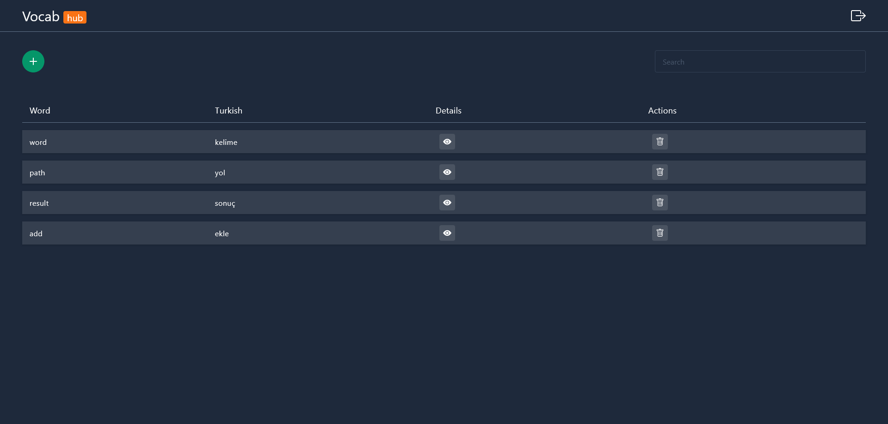
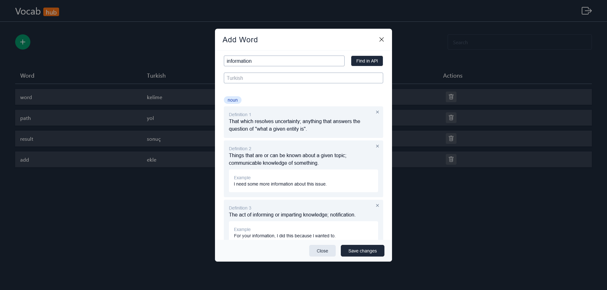
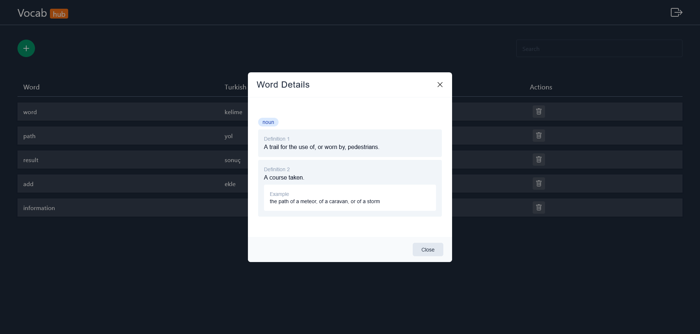

# Dictionary App
Vue.js ve Supabase kullanarak geliştirdiğim ingilizce kelimeleri yönetebileceğiniz bir uygulama. 
Bu uygulamada temel hedefim İngilizce kelimeleri https://dictionaryapi.dev/ API si aracılığı ile anlamlarını,örnek cümleleri Supabase veritabanına kayıt etmek ve yönetebilmektir.
> Kişisel kullanım için geliştirdiğim bir uygulama.

## Kullandığım Teknolojiler
* Vue.js
* Pinia
* vue-router
* Tailwind
* Supabase

### Ekran Görüntüleri

